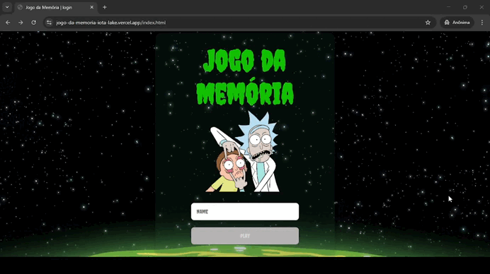

# 🧠 Jogo da Memória — _Rick and Morty Edition_

## 1. Prefácio

Este projeto foi desenvolvido como parte da disciplina de Algoritmos e Programação, com o objetivo de praticar estruturas condicionais, de repetição, manipulação de arrays (matrizes) e lógica de programação, foram utilizandos JavaScript e conceitos fundamentais da construção de interfaces web.

---

## 2. Resumo do Projeto

Este é um jogo da memória temático inspirado na série **Rick and Morty**, em que o jogador deve encontrar pares de cartas com personagens do universo da animação. O jogador revela as cartas ao clicar nelas e deve memorizar suas posições para encontrar os pares com o menor número de tentativas possível.

Além do funcionamento básico, o jogo possui:

- Interface visual estilizada com elementos de Rick and Morty;
- Níveis de dificuldade com diferentes quantidades de cartas;
- Cronômetro em tempo real;
- Contadores de tentativas e acertos.

---

## 3. Demonstração de Uso



1. O jogador insere o nome e seleciona o nível de dificuldade (Fácil, Médio ou Difícil).
2. O jogo é iniciado com cartas embaralhadas, contendo **personagens de Rick and Morty**, dispostas de acordo com o nível escolhido.
3. Ao clicar nas cartas, elas são reveladas:
   - Se forem iguais: permanecem visíveis;
   - Se forem diferentes: são escondidas novamente após 0.5 segundos.
4. O jogo termina quando todos os pares são encontrados.

---

## 4. Critérios Mínimos de Aceitação do Projeto

✔️ Utilização de **matriz (array bidimensional)** para representar o tabuleiro.  
✔️ Implementação de **contadores de tentativas e acertos**.  
✔️ Criação de **interface gráfica interativa** utilizando HTML, CSS e JavaScript puro.  
✔️ Implementação de **níveis de dificuldade** (fácil, médio e difícil), conforme critério extra-classe.  
✔️ Adição de **sistema de cronômetro** como funcionalidade extra.

---

## 5. Especificações Técnicas

- **Tecnologias Utilizadas**:
  - HTML5
  - CSS3
  - JavaScript (sem bibliotecas externas)
- **Lógica Principal**:

  - Uso de matrizes para organizar as cartas.
  - Manipulação do DOM para revelar e esconder cartas.
  - Contagem de tentativas e acertos em tempo real.
  - Timer controlado via `setInterval`.

- **Estrutura de Pastas**:
  ```
  /src
   ├── assets/
   │   └── image/
   |     └── [...imagens de personagens Rick and Morty...]
   ├── game/
   │   ├── game.html
   │   ├── game.js
   │   └── game.css
   ├── login/
   │   ├── login.js
   |   └── login.css
   ├── select-level/
   │   ├── select-level.html
   │   ├── select-level.js
   |   └── select-level.css
   ├── reset/
   |   └── reset.css
   ├── index.html
   └── README.md
  ```

---

## 6. Implementações Futuras

- Sistema de ranking com melhores tempos por nível.
- Salvamento do progresso no `localStorage`.
- Versão mobile otimizada com suporte a toque.
- Sons de efeito ao acertar ou errar pares.

---

## 7. Desenvolvedoras

👩‍💻 Jayanny Santana – [[GitHub](https://github.com/jay-santana) / [LinkedIn](https://www.linkedin.com/in/jayanny-santana/)]  
👩‍💻 Maria Clara de Oliveira – [GitHub / LinkedIn]

---
